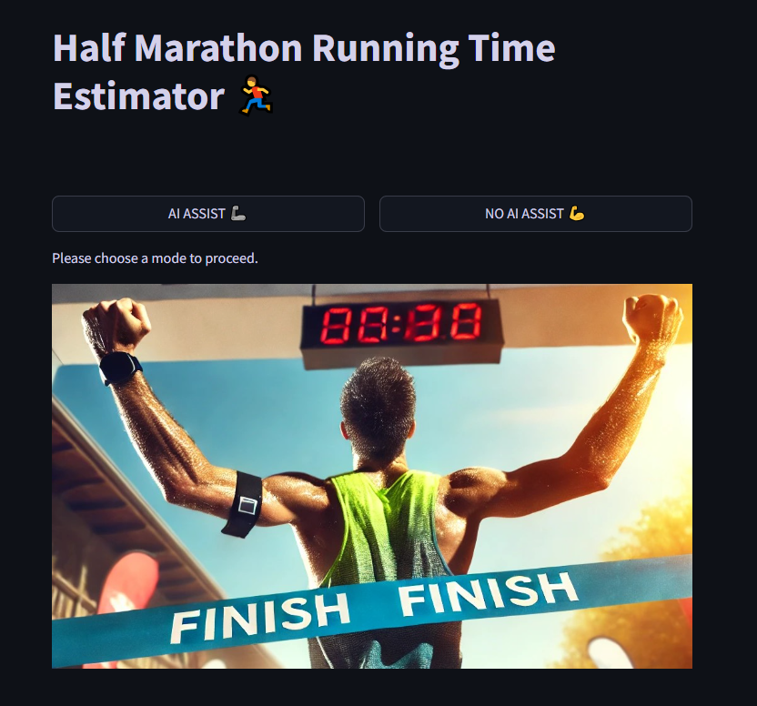
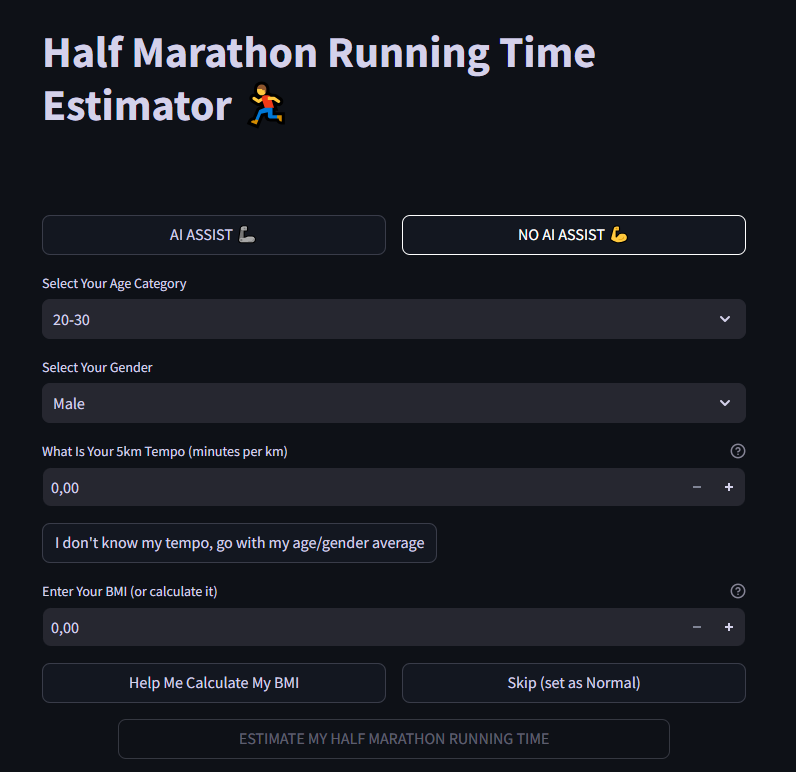
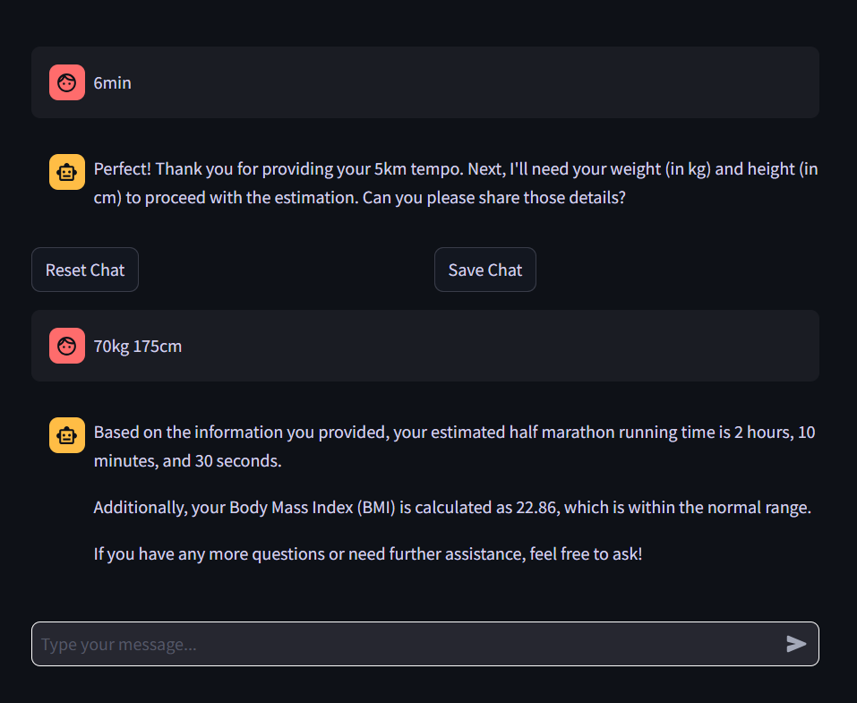

# Half Marathon Time Predictor App

<a href="https://lily10coloringbooks.online/" class="md-button md-button--primary"> Link to the app</a>

## Overview

Introducing the Half Marathon Time Predictor, an innovative application I developed to accurately estimate your half marathon completion time by leveraging advanced machine learning techniques. Whether you're a seasoned runner or just starting your fitness journey, my app seamlessly integrates personalized data to provide reliable time predictions, helping you set and achieve your running goals with confidence.

    

        <h4>Home Screen</h4>
        
    

    

        <h4>Data Entry</h4>
        
    

    

        <h4>Prediction Results</h4>
        
    

## Key Features

### Dual Operation Modes:

- Classic Mode: Manually input your personal data, including gender, age, average pace per kilometer, and BMI.
- AI-Assisted Mode: Engage in a conversational interface where the chatbot intelligently gathers your information, ensuring a smooth and interactive user experience.

### Comprehensive Data Handling:

- BMI Calculation: Automatically computes your BMI based on provided weight and height if not directly supplied.
- Pace Estimation: If your running pace isn't specified, the app intelligently substitutes it with the median pace derived from extensive marathon datasets segmented by age and gender.

### Consistent Machine Learning Model:

Both modes utilize the same robust machine learning model hosted in the cloud, ensuring uniform and dependable time predictions regardless of the input method.

### Advanced Time Adjustment:

Incorporates BMI-based time offsetting to refine accuracy beyond standard modeling techniques like PyCaret.

### Real-Time Monitoring and Logging:

Langfuse Integration: Provides continuous monitoring of app performance and user interactions.
Cloud Storage: Securely stores all user conversations and input data in the cloud, ensuring data integrity and accessibility.
User Assistance:

The AI mode offers contextual help, guiding users through the data entry process while requiring at least a minimal pace input (e.g., 1 km) to function effectively.
Technologies and Skills Utilized

### Data Analysis & Modeling:

- Jupyter Lab: Utilized for developing and testing the machine learning models.
- Pandas: Employed for efficient data manipulation and analysis.
- Machine Learning (Regression): Implemented to predict half marathon completion times based on user inputs.
- PyCaret: Leveraged for streamlined machine learning workflows and model optimization.

### Cloud Services & Deployment:

- AWS S3: Facilitated secure uploading and storage of datasets and user inputs.

### Monitoring & Maintenance:

- Langfuse: Integrated for real-time monitoring of application performance and user interactions.

### Development & Version Control:

- GitHub: Managed source code, collaboration, and version control to ensure seamless development and deployment processes.

## Why Choose My App?

- Precision: Combines multiple personal metrics with sophisticated machine learning algorithms to deliver highly accurate predictions.
- Flexibility: Offers both manual and AI-driven data input methods to cater to diverse user preferences.
- Reliability: Ensures consistent results by utilizing a unified machine learning model across all operation modes.
-  Security: Maintains the highest standards of data security with cloud storage and monitored interactions.
- User-Friendly: Designed with intuitive interfaces and helpful guides to enhance user experience.

Embark on your half marathon journey with confidence. Let my Half Marathon Time Predictor App provide the insights you need to train smarter and run stronger.

<a href="https://runest-app-yua3l.ondigitalocean.app/" class="md-button md-button--primary"> Link to the app</a>

## Screenshots

Here are some screenshots showcasing the app's interface and features:

*Home Screen*

*Data Entry*

*Prediction Results*

