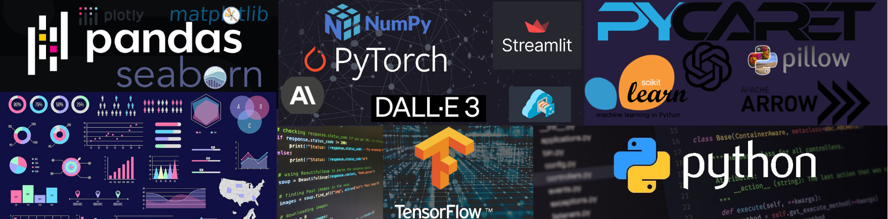

# Welcome to My Portfolio

**If you like this portfolio please leave a comment in the comments section at the bottom of the page.**

## About Me

Hello! My name is Mateusz Nowakowski, and I am a passionate data scientist and AI enthusiast. This portfolio showcases my work in data science and artificial intelligence, where I apply cutting-edge techniques to solve real-world problems.

<a href="https://mateusznowakowski2024.github.io/ds_ai_portfolio/contact/" class="md-button md-button--primary">Get in Touch</a>

## Projects Overview

### Current Projects

#### Prompt Master
**Transforming AI Interactions**
PromptMaster is a tool designed to simplify how users create and manage prompts for Large Language Models (LLMs). It aims to make interactions with AI clearer and more effective. Key features include easy input via text or voice, smart editing, organized project management, session management, and output modification. This tool is essential for professionals, educators, and creatives looking to enhance their AI interactions.

#### Lily 2.0
**Revolutionizing Coloring Experiences for Kids**
Lily 2.0 is the next-generation version of my coloring book app, Lily 1.0. It integrates advanced AI and voice command features, making it more interactive and user-friendly for children and their guardians. Key features include voice-activated interaction, AI-driven coloring, interactive coloring, and a user-friendly design. Lily 2.0 transforms traditional coloring books into an engaging, voice-controlled experience powered by AI.

### Previous Projects

#### Lily 1.0
**Advanced Coloring Book Generator**
Lily 1.0 is a cutting-edge coloring book generator designed for children. It blends a user-friendly interface with sophisticated backend technologies to inspire creativity and provide endless fun. Key features include an intuitive interface, interactive chat assistant, and three generation options: random coloring page, description-based coloring page, and photo to coloring page. The app utilizes advanced AI integration, machine learning, and image processing to deliver a seamless experience.

#### Running Time Estimator
**Half Marathon Time Predictor App**
This app predicts half marathon completion times based on user inputs, incorporating BMI-based time offsetting for refined accuracy. It offers real-time monitoring and logging, cloud storage, and user assistance through AI mode. The app leverages technologies like Jupyter Lab, Pandas, PyCaret, AWS S3, and Langfuse for data analysis, cloud services, and monitoring.

#### Iris EDA
**Exploratory Data Analysis on the Iris Dataset**
This project involves performing an exploratory data analysis (EDA) on the famous Iris dataset. The analysis includes data visualization, statistical analysis, and machine learning techniques to uncover patterns and insights within the data. Key features include interactive visualizations, detailed statistical summaries, and predictive modeling using Scikit-learn.

#### Titanic EDA
**Exploratory Data Analysis on the Titanic Dataset**
This project focuses on conducting an exploratory data analysis (EDA) on the Titanic dataset. The analysis aims to understand the factors that influenced passenger survival rates. Key features include data cleaning, feature engineering, visualization of survival statistics, and predictive modeling using machine learning algorithms.

### Technologies and Skills Utilized

- **Programming Languages**: Python
- **Machine Learning & AI**: PyCaret, Scikit-learn, GPT-4o-mini, DALL-E 3, Whisper 1, PyTorch
- **Data Analysis & Manipulation**: Jupyter Lab, Pandas, Matplotlib, Seaborn, Plotly, SciPy
- **Cloud Services**: AWS S3, Qdrant, Langfuse, Streamlit
- **Image Processing**: Scikit-image, PIL, KMeans clustering
- **Development & Version Control**: GitHub
- **Real-Time Monitoring**: Langfuse
- **Web Development**: HTML, CSS, Streamlit

This portfolio highlights my ability to apply advanced data science and AI techniques to create innovative solutions. From enhancing AI interactions to developing engaging educational tools, my projects demonstrate a commitment to leveraging technology for impactful results.

<a href="https://mateusznowakowski2024.github.io/ds_ai_portfolio/contact/" class="md-button md-button--primary">Get in Touch</a>

