# Lily-1.0 Advanced Coloring Book Generator!

  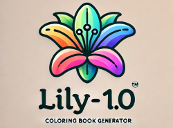
   
  <a href="https://lily-1-0-app-e5maz.ondigitalocean.app/" class="md-button md-button--primary">Lily-1.0 App</a>

## Overview

Lily-1.0 is a cutting-edge coloring book generator designed for children, seamlessly blending a user-friendly interface with sophisticated backend technologies to inspire creativity and provide endless fun.

<table>
  <tr>
    <td></td>
    <td></td>
    <td><a href="images/cat_2_outline_image.png" target="_blank">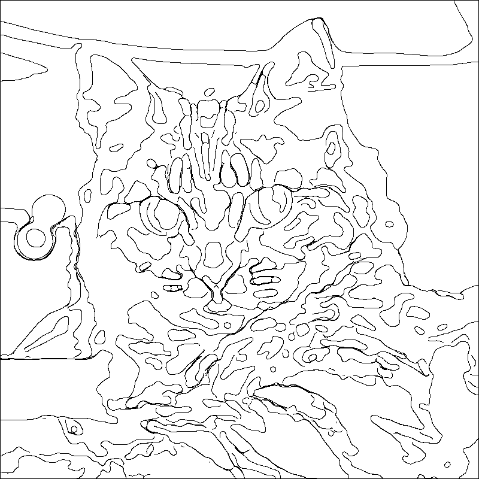</a></td>
  </tr>
</table>
## Key Features

### Intuitive Interface

The main layout features a single “Reset Session” button, allowing users to effortlessly start fresh by clearing chat history and session states.

### Interactive Chat Assistant

Engage with Lily-1.0 through a chat interface powered by GPT-4o-mini. The assistant guides users through three creative options to generate personalized coloring pages.
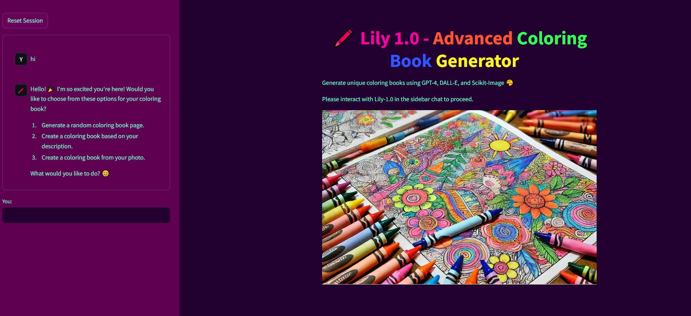
## Three Generation Options

### Random Coloring Page

Instantly generate a random coloring page. Lily creates a unique prompt, and upon approval, DALL-E 3 generates a downloadable image.

### Description-Based Coloring Page

Create a custom coloring page based on your own descriptions. Whether you provide a detailed description or just a few keywords, Lily refines the input and uses DALL-E 3 to produce a personalized image.

### Photo to Coloring Page

Transform your own photos into coloring pages. Upload a photo, adjust parameters with intuitive sliders, and click "Convert Photo" to receive a downloadable coloring version. Lily assists by explaining the settings and their effects.
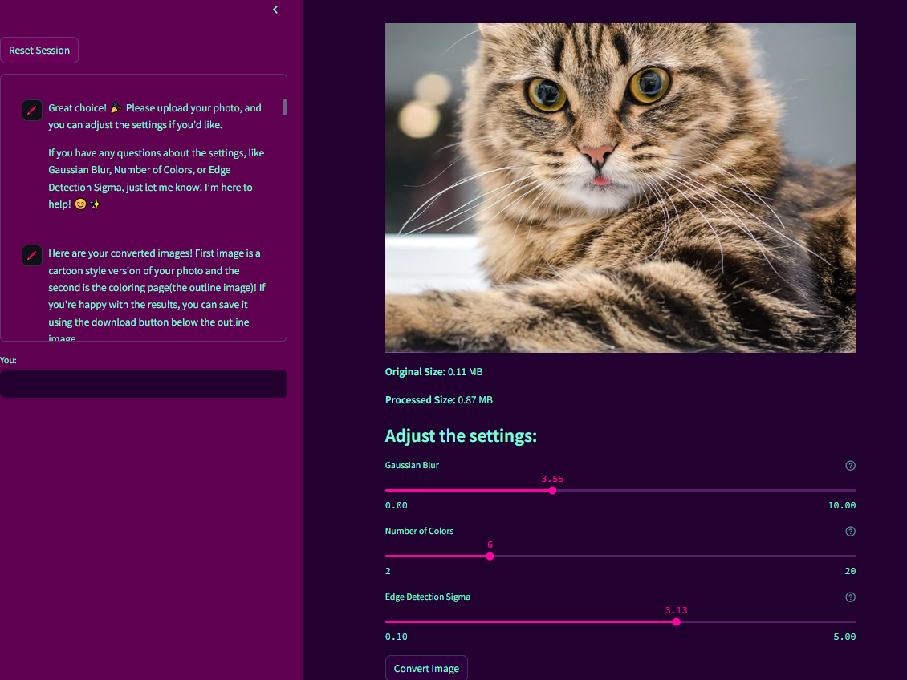

## Technical Highlights

### Advanced AI Integration

Utilizes GPT-4o-mini for intelligent and engaging chat interactions, and DALL-E 3 for high-quality image generation.

### Machine Learning & Image Processing

Implements Scikit-learn, Scikit-image, KMeans clustering, and PIL to efficiently convert photos into coloring pages without relying on resource-intensive libraries like TensorFlow. This results in a streamlined process reduced from 500 to approximately 80 lines of code.

### Optimized Performance

Automatically resizes uploaded images to ≤1.5 MB and 1024x1024 resolution using PIL, ensuring quick processing and minimal loading times.

### Efficient Image Clustering

Uses KMeans clustering to simplify images into 2-20 color clusters, outlining boundaries with black lines to create clear and engaging coloring pages.
<table style="width:100%">
  <tr>
    <td style="width:33.33%"><a href="images/ocean_original.png" target="_blank">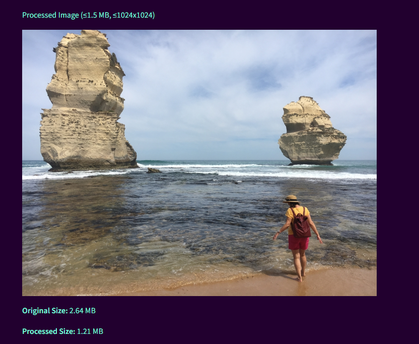</a></td>
    <td style="width:33.33%"><a href="images/ocean_colorbook.png" target="_blank">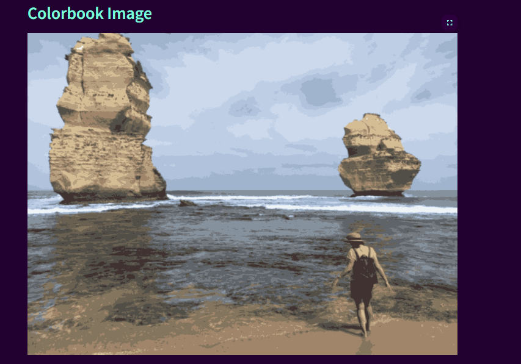</a></td>
    <td style="width:33.33%"><a href="images/ocean_outline.png" target="_blank">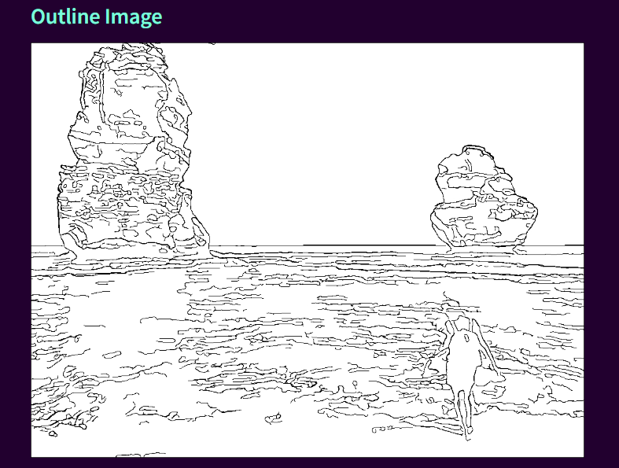</a></td>
  </tr>
</table>

### User-Friendly Design

Simple navigation through easy commands such as “hi” to start and “main options” to return to the menu, making the app accessible for both children and adults.

### Advanced Functionality

Combines machine learning techniques like image clustering and cartoonization with persona-adopted chat assistance, offering a rich and interactive user experience.

## Why Choose Lily-1.0?

Lily-1.0 Advanced Coloring Book Generator stands out by offering a sleek and minimalistic interface while leveraging state-of-the-art technologies in the backend. This combination ensures that users enjoy a smooth and engaging experience, whether they’re generating random designs, customizing based on their descriptions, or transforming personal photos into delightful coloring pages. Lily-1.0 is not just a coloring book generator; it’s a gateway to creativity powered by the latest advancements in AI and machine learning.

  <a href="https://lily-1-0-app-e5maz.ondigitalocean.app/" class="md-button md-button--primary">Lily-1.0 App</a>

## Gallery

Check out the gallery to see more images created by Lily-1.0.

<table>
  <tr>
    <td></td>
    <td><a href="images/coloring_page_2.png" target="_blank">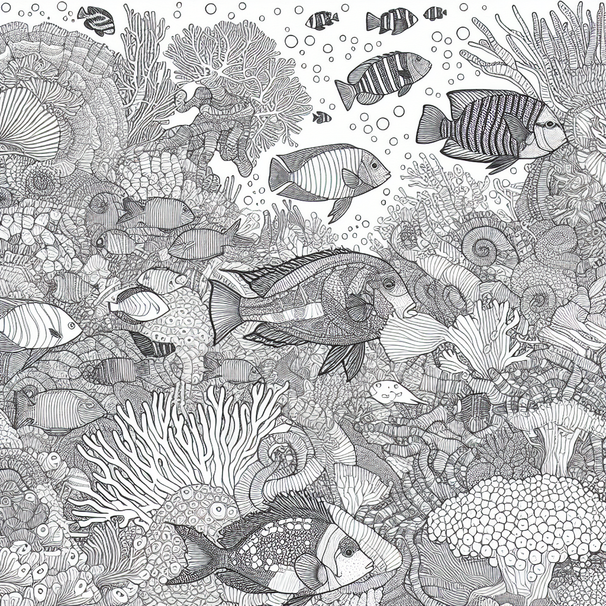</a></td>
    <td></td>
    <td></td>
  </tr>
  <tr>
    <td></td>
    <td></td>
    <td><a href="images/coloring_page_7.png" target="_blank">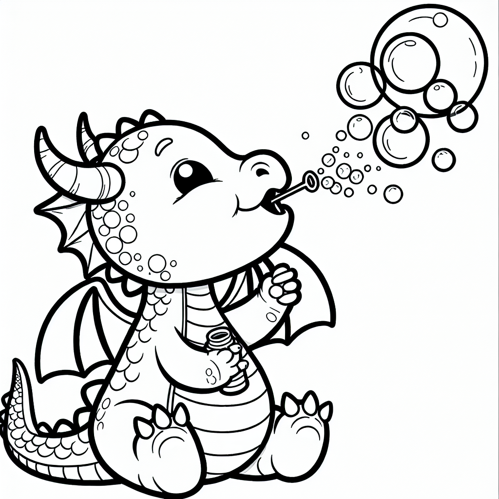</a></td>
    <td></td>
  </tr>
</table>

<table>
  <tr>
    <td><a href="images/Lion.png" target="_blank">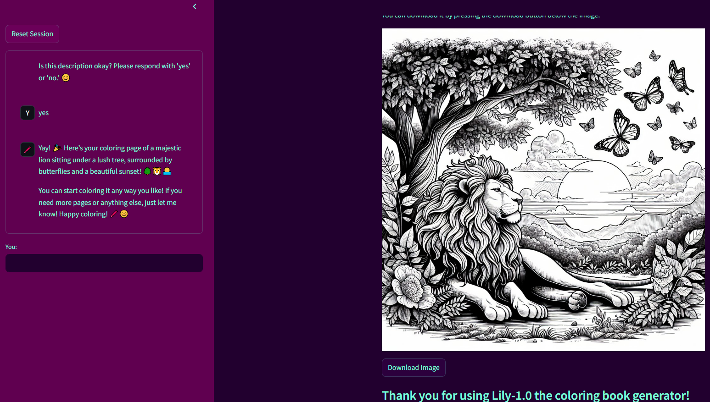</a></td>
    <td><a href="images/chat_example.png" target="_blank">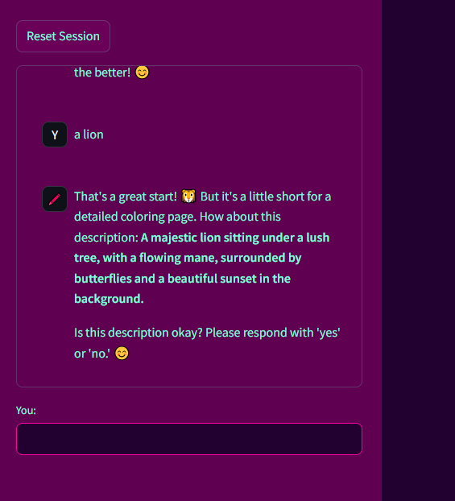</a></td>
    <td><a href="images/castle_image.png" target="_blank">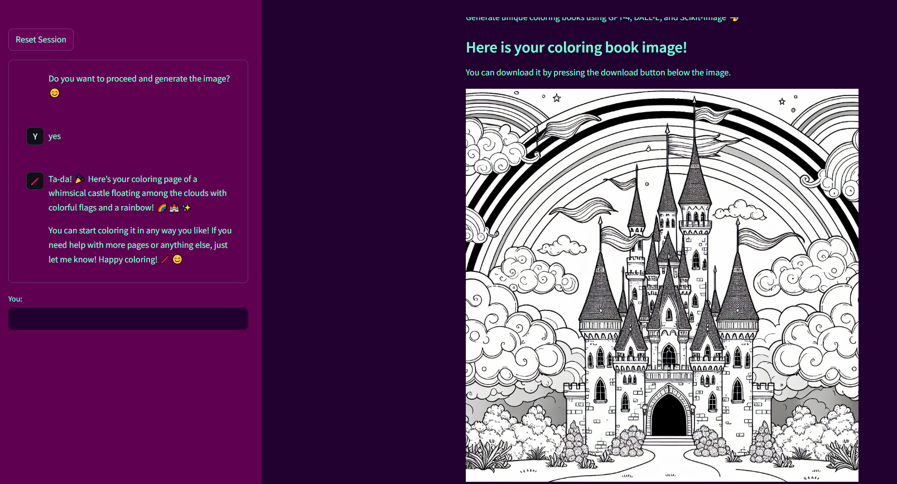</a></td>
    <td><a href="images/adjustments.png" target="_blank">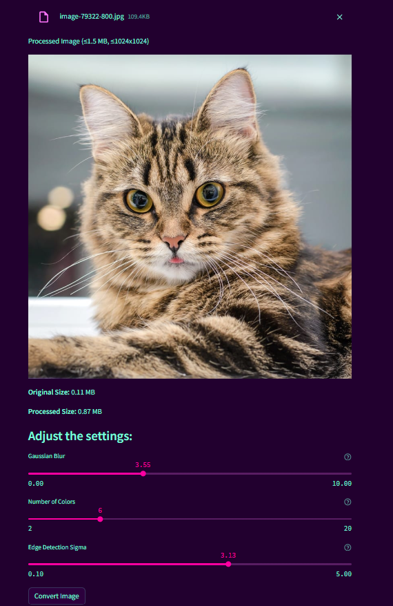</a></td>
  </tr>
</table>
