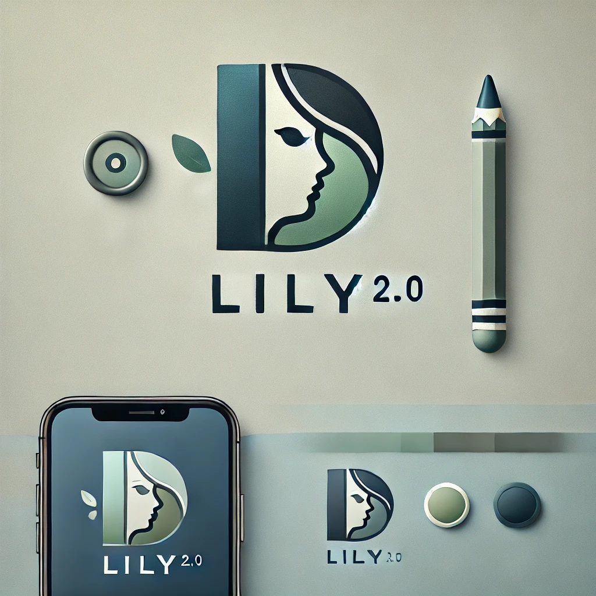

# Project Spotlight: Lily 2.0
## Revolutionizing Coloring Experiences for Kids

I am excited to present **Lily 2.0**, the next-generation version of my popular coloring book app, Lily 1.0. Lily 2.0 takes the coloring experience to a completely new level by integrating advanced AI and voice command features, making it more interactive and user-friendly for children and their guardians.

    

### Project Overview

Lily 2.0 is designed to allow users to generate unique coloring books and color them within the app using simple voice commands. The app remains incredibly easy to use, ensuring that children can enjoy creating and coloring without any technical difficulties. All the complex AI and machine learning processes, powered by technologies like Scikit-learn, Pillow, and PyTorch, work seamlessly in the background, providing a smooth and engaging experience.

### Key Features

#### Voice-Activated Interaction

- **Easy Commands**: Users can create and color their coloring books by speaking to Lily, the friendly chatbot.
- **Voice to Text**: Voice recordings are transcribed into text using Whisper 1, which Lily uses to generate and modify coloring pages.

#### AI-Driven Coloring

- **Smart Generation**: Generate personalized coloring books based on user descriptions and photos.
- **Element Segmentation**: An advanced algorithm, utilizing PyTorch, processes and segments the outline images into individual elements with assigned names, allowing precise coloring.

#### Interactive Coloring

- **Select and Color**: Users can choose specific elements from a list and select colors, which are then applied to the chosen parts of the image.
- **Real-Time Feedback**: See colors applied instantly, making the coloring process fun and engaging.

#### User-Friendly Design

- **Simple Interface**: Designed for children and their guardians, ensuring ease of use with a playful and intuitive layout.
- **Friendly Chatbot**: Lily guides users through the process with cheerful interactions, making the experience enjoyable.

### Why Lily 2.0?

Lily 2.0 transforms a traditional coloring book into an interactive, voice-controlled experience powered by AI. By making the app more dynamic and engaging, it not only entertains but also fosters creativity and learning in children. This innovative approach sets Lily 2.0 apart, making it a standout tool in educational and recreational apps for kids.

### Current Status and Invitation

Lily 2.0 is currently in the early research stage. I am dedicated to developing a high-quality, cutting-edge app that will redefine how children interact with coloring books. I am seeking investors who are passionate about educational technology and innovation to support this exciting project.

Additionally, I invite AI and data science professionals who are interested in joining this transformative project to reach out and collaborate. Together, we can bring Lily 2.0 to life and create a magical coloring experience for children everywhere.
